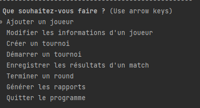
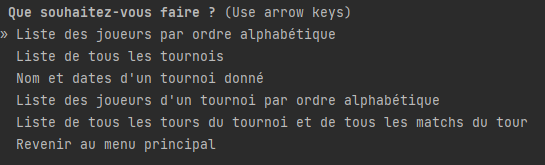
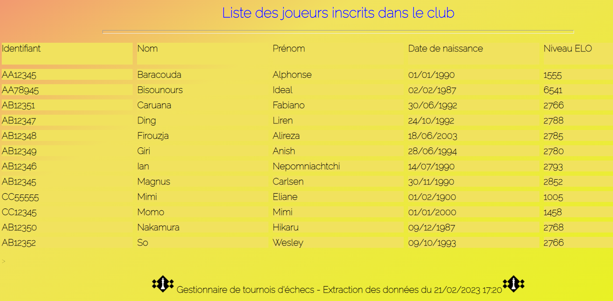

# Oc-P4 Développez un programme logiciel en Python
---


## Objectif
Ce programme est un projet proposé par [OpenClassRooms](https://openclassrooms.com/fr/) dans le cadre de la formation :
Développeur d'applications Python.
Il s'agit d'un gestionnaire de tournois d'échecs fonctionnant hors ligne à destination d'un club d'échecs.

## Fonctionnement
L'application contient une base de données des joueurs et des tournois réalisés. Cette base de données est stockée
en local sous la forme d'un fichier JSON.
Une fois le programme lancé, un menu principal est proposé au manager des tournois.



Les reports sont généré au format html et directement ouverts dans le navigateur.


Exemple de reports :




## Installation
```bash
# Creer l'environnement virtuel
python -m venv env
source env/bin/activate

# cloner le projet
git clone https://github.com/Slb59/Oc-P4.git
cd Oc-P4

# installer les dépendances
pip install -r requirements.txt

# executer le programme
python chess.py
```

## Structure du projet

### docs
Les documents d'analyse du projet se trouve dans le répertoire [docs](https://github.com/Slb59/Oc-P4/tree/main/docs).
Il contient le diagramme des cas d'usages, le diagramme des classes et la description des menus proposés et de leur
diagramme d'activité associé. Les spécifications techniques sont également stockées à cet endroit.

### data
On trouve dans le répertoire [data](https://github.com/Slb59/Oc-P4/tree/main/data), le logo du club d'échecs et la 
base de données JSON

### flake-report
Il s'agit du rapport flake8 assurant que le code respect les conventions PEP8. Il est possible de visualiser ce rapport 
en ouvrant dans un navigateur le fichier [index.html](https://github.com/Slb59/Oc-P4/blob/main/flake-report/index.html)

### output
Le répertoire [outputs](https://github.com/Slb59/Oc-P4/tree/main/outputs) contient les données de log d'exécution
du programme, le pep8.log généré par pycodestyle et les rapports demandés par le manager de tournois.

### tests
Le répertoire [tests]() contient les programmes de test du programme. Cette technique assurant la non régression et 
la qualité du code.

### chessmanager
Le répertoire [chessmanager](https://github.com/Slb59/Oc-P4/tree/main/chessmanager) contient le code du programme
au format MVC.

## Utilisation
Le programme se lance via la commande :
```bash
python chess.py
```

Il est possible de modifier les répertoires de sortie des rapports (par défaut outputs) et de data (stockage de la
base de données)
```bash
python chess.py --output_dir mon_rep_output --data_dir mon_rep_data
```

## Rapport flake
Il est possible de générer un rapport flake8 en utilisant flake8-html.

```
$ flake8 chessmanager chess.py --format=html --htmldir=flake-report
```

Le script ``report_flake8.sh`` fait cela.

```
$ chmod +x report_flake8.sh
$ ./report_flake8.sh
```

Avec Pycharm, flake8 doit être installé comme outil externe

Il est également possible de générer un rapport avec pycodestyle dans le répertoire outputs :

```
$ chmod +x pep.sh
$ ./pep.sh
```
